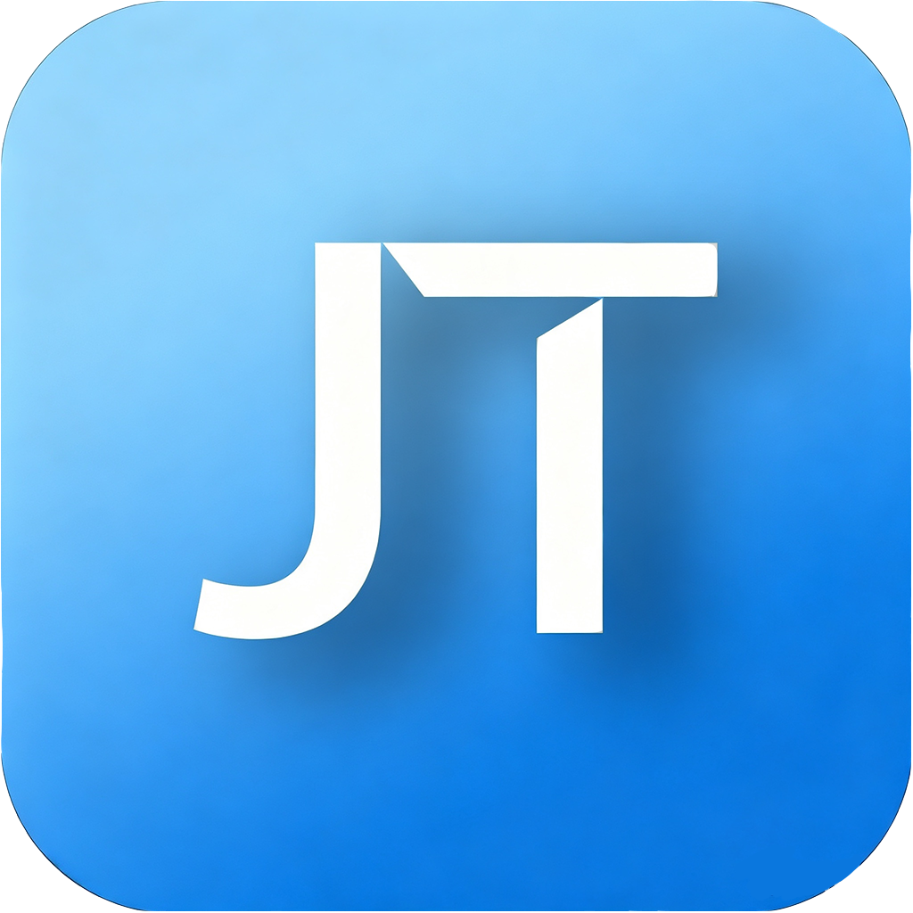
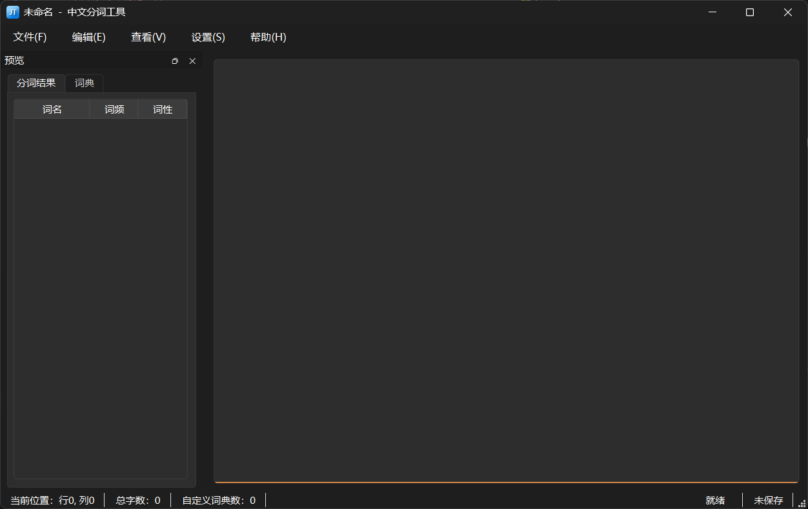
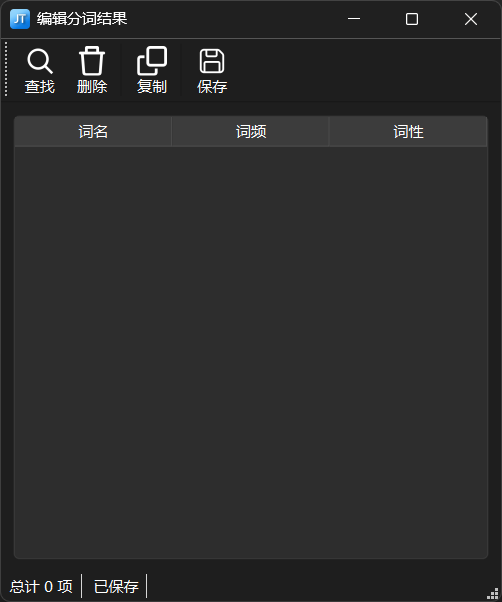
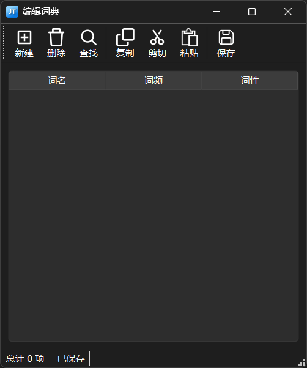

# JiebaTool - 中文分词可视化工具


基于 Jieba 分词核心构建的轻量级GUI桌面应用

---

## 目录
- [一、项目简介](#一项目简介)
- [二、核心特性](#二核心特性)
- [三、使用方法](#三使用方法)
- [四、使用指南](#四使用指南)
- [五、配置说明](#五配置说明)
- [六、项目结构](#六项目结构)
- [七、版本更新](#七版本更新)
- [八、贡献和反馈](#八贡献和反馈)
- [九、许可证](#九许可证)

---

## 一、项目简介
JiebaTool 中文分词可视化工具是一款高效、灵活、轻量级的桌面应用，以 jieba 为分词核心，PySide6 为GUI框架构建，旨在实现中文分词的可视化统计、管理，并为需要处理大规模中文文本的用户设计。

---

## 二、核心特性
1. 分词结果和自定义词典可视化
2. 支持分词结果和自定义词典的导入和导出
3. 可动态调整词典词条
4. 可设置多种分词模式
5. 支持十万字以上文本进行分词

---

## 三、使用方法
- 系统要求 Windows 系统
- 环境要求 python 3.8以上
- 克隆仓库 `git clone https://github.com/Aq789/JiebaTool.git`
- 安装依赖命令 `pip install -r requirements.txt`
- 启动命令 `python main.py`

---

## 四、使用指南

### 1. 布局简介



- **主窗口**
  - **菜单栏**：位于窗口顶部，列出所有操作
  - **侧边栏**：初始位于左端，位置可以调整；目前只做了预览窗口，预览分词结果和自定义词典；预览窗口不支持直接编辑
  - **工作区**：位于窗口中心，支持纯文本格式，用来存放预分词文本；支持右键菜单
  - **状态栏**：位于主窗口底部，显示字数统计、状态显示等信息



- **编辑分词结果窗口**
  - **工具栏**：位于窗口顶部，位置可调整，对分词结果词条进行修改 *（分词结果目前只支持删除，不支持新建和修改）*
  - **工作区**：位于窗口中心，显示分词结果的词名、词频和词性；支持表头排序
  - **状态栏**：位于窗口底部，显示基本信息



- **编辑词典窗口**
  - **工具栏**：位于窗口顶部，位置可调整，对词典词条进行修改
  - **工作区**：位于窗口中心，显示词典的词名、词频和词性；支持在单元格上修改；支持表头排序
  - **状态栏**：位于窗口底部，显示基本信息

### 2. 操作说明

- **添加预分词文本**
  - **在主窗口编辑**：用户可以将预分词文本输入到工作区的输入框中；输入框不支持富文本，只支持纯文本
  - **导入文本**：用户也可以通过导入 *.txt* 文件将预分词文本输入到工作区的输入框中
  - **打开项目文件**：用户可以将上次保存的分词项目文件 *.jbt* 打开，在项目文件的基础上进行重新分词或修改


- **设置分词选项**
  - **全局设置**：在开始分词之前，建议用户在 *设置/全局设置/分词选项（或者使用快捷键“Shift+F5”）* 中选择分词模式以及有关选项 
  - 默认**主词典**为 jieba 库**默认词典**，极力不推荐用户**将主词典设置为自定义词典路径**


- **编辑自定义用户词典**
  - **编辑词典窗口**：在预分词文本中，如果用户有不希望被分词分开的专用词、名字等，可以在 *编辑/编辑词典（或者使用快捷键“Shift+F2”）* 打开的编辑词典窗口中编辑。
  - 在编辑词典窗口中，可粘贴对应格式的文本行，系统将自动转换为表格
  - 在编辑词典窗口中，词频可以为空，此时系统将此词条标注为强词条，确保 jieba 不会分割
  - 在编辑词典窗口中，词性目前只支持字母，可在 *帮助/帮助* 中查找字母词性名和中文词性名映射表
  - **导入自定义词典**：自定义词典可以被导入，支持 *.txt* *.csv* 或者此程序支持的词典文件 *.dic* 文件，推荐使用 *.dic* 文件


- **开始分词**
  - **开始分词**：当用户准备好后，可点击 *编辑/开始分词/所有文本（或者使用快捷键“Shift+F3”）* 开始分词
  - **部分文本分词**：用户也可在选择一段文本后，点击 *编辑/开始分词/仅选中文本（或者使用快捷键“Shift+F4”）* 进行部分分词


- **编辑分词结果**
  - **编辑分词结果窗口**：分词完成后，分词结果会同时在预览窗口中的分词结果表格和编辑分词结果窗口中的表格显示；用户修改后需保存
  - 当用户编辑分词结果后，可将结果导出，或者保存项目文件


### 3. 示例文本
- 示例项目文件下载：[《中国人失掉自信力了吗》](https://raw.githubusercontent.com/Aq789/JiebaTool/resources/example/中国人失去自信力了吗.zip)
- 示例文本：  
```
北京时间8月13日，中国天眼FAST团队宣布，基于深度学习的脉冲星识别模型已成功发现数十颗新脉冲星。同时，SpaceX的星链项目再次发射了60颗低轨卫星，全球科技界对此反应热烈。
```
- 示例词典：  
```
天眼 100 nz
FAST 120 nz
脉冲星 150 n
深度学习 200 n
算法 80 n
# 这是一行注释

SpaceX 100 nz
星链 90 nz
低轨卫星 110 n
项目 60
发射 70
```

---

## 五、配置说明

### 1. 分词设置 *seg_settings.json*
| 选项     | 说明                                 |
|:-------|:-----------------------------------|
| 切分模式   | 设置 jieba 的不同分词模式 （全模式、精确模式、搜索引擎模式） |
| 统计词频   | 分词过程中是否统计词频（即词出现的次数）               |
| HMM    | 提前辨识陌生词，为 jieba 参数之一               |
| 显示中文词性 | 在表格中显示词性简写或中文词性                    |
| 主词典设置  | 设置主词典是默认词典还是自定义词典                  |

### 2. 窗口设置 *window_settings.json*
| 选项     | 说明              |
|:-------|:----------------|
| 窗口宽度   | 主窗口的宽度，单位为像素    |
| 窗口高度   | 主窗口的高度，单位为像素    |
| 默认自动换行 | 每次打开程序时设置自动换行状态 |

### 3. 字体设置 *font_settings.json*
| 选项 | 说明                  |
|:---|:--------------------|
| 字体 | 设置工作区的字体类型          |
| 字形 | 设置工作区的字体字形          |
| 字号 | 设置工作区的字体大小          |
| 效果 | 设置工作区的字体是否拥有下划线或删除线 |

所有配置都保存在用户统一存放配置文件目录 *AppData* 下，下次启动时自动检测并加载，用户无需修改

---

## 六、项目结构
### 1. 源文件目录 app
app目录是整个项目的核心，其中包括了以下模块：
- controllers 控制器：功能核心，负责协调界面与数据
- datas 数据集：承载基本数据，负责程序数据的记录
- service 服务端：提供算法，以及控件的重写
- widget 界面端：提供可视化界面

### 2. 资源目录 resources
- icons 存放图标文件
- styles 存放控件样式

### 3. 测试目录 test
用来测试项目的某个模块

### 4. 项目树展示

```tree
JiebaTool/
├── app/
│   ├── controllers/
│   │   ├── edit_widget/
│   │   │   ├── __init__.py
│   │   │   ├── word_dic_widget.py
│   │   │   └── word_seg_result_widget.py
│   │   ├── io/
│   │   │   ├── __init__.py
│   │   │   ├── input.py
│   │   │   └── output.py
│   │   ├── __init__.py
│   │   ├── central_widget.py
│   │   ├── file.py
│   │   ├── menu.py
│   │   ├── preview_window.py
│   │   ├── settings_widget.py
│   │   └── statistic_widget.py
│   ├── datas/
│   │   ├── __init__.py
│   │   ├── file.py
│   │   ├── font_settings.py
│   │   ├── seg_settings.py
│   │   ├── statistic.py
│   │   ├── text.py
│   │   ├── window_settings.py
│   │   ├── word_dic.py
│   │   └── word_seg_result.py
│   ├── service/
│   │   ├── io/
│   │   │   ├── __init__.py
│   │   │   ├── file.py
│   │   │   ├── input.py
│   │   │   ├── output.py
│   │   │   └── settings.py
│   │   ├── jieba/
│   │   │   ├── __init__.py
│   │   │   ├── dictionary.py
│   │   │   ├── start.py
│   │   │   ├── word_class.py
│   │   │   └── word_frequency.py
│   │   ├── pyside6/
│   │   │   ├── __init__.py
│   │   │   ├── int_with_validation_delegate.py
│   │   │   ├── numeric_table_item.py
│   │   │   ├── string_non_empty_delegate.py
│   │   │   └── table_widget.py
│   │   ├── __init__.py
│   │   ├── choose_font_shape.py
│   │   ├── settings.py
│   │   ├── statistic.py
│   │   ├── word_class_name.py
│   │   └── word_dic.py
│   ├── widget/
│   │   ├── edit_widget/
│   │   │   ├── __init__.py
│   │   │   ├── word_dic_widget.py
│   │   │   └── word_seg_result_widget.py
│   │   ├── settings/
│   │   │   ├── __init__.py
│   │   │   ├── font_tab.py
│   │   │   ├── seg_tab.py
│   │   │   ├── settings_widget.py
│   │   │   └── window_tab.py
│   │   ├── __init__.py
│   │   ├── central_widget.py
│   │   ├── check_widget.py
│   │   ├── dock_widget.py
│   │   ├── menu.py
│   │   ├── preview_window.py
│   │   ├── statistic_widget.py
│   │   └── status_widget.py
│   ├── __init__.py
│   └── view.py
├── LICENSE
├── README.md
├── main.py
├── requirements.txt
└── ...
```

---

## 七、版本更新

可参考本仓库在 Github 的提交记录

### 0.6.1 ~ 0.6.5 -alpha
- 为编辑分词结果窗口和编辑词典窗口添加右键菜单
- 为菜单栏添加快捷键
- 为预览窗口和工作区添加快捷键
- 为编辑分词结果界面和编辑词典界面加入快捷键
- 为菜单栏和右键菜单添加图标

### 0.4.1 ~ 0.5.5 -alpha
- 现已实现主窗口的复制、剪切和粘贴
- 现已实现编辑分词结果窗口的复制和编辑词典窗口的复制、剪切、粘贴
- 增加查找功能和编辑框的撤销恢复功能
- 增加保存项目文件功能，并可以从标题栏和状态栏显示文件状态
- 增加另存为项目文件功能，并添加保存和另存为右下角状态栏进度条显示
- 增加打开项目文件功能和增加新建项目文件功能
- 增加导入文本文件，导入词典文件功能
- 增加导出文本内容，导出词典内容，导出分词结果内容
- 支持在菜单栏中关闭窗口

### 0.3.1-s ~ 0.4.0 迁移版本
- GUI核心由 Tkinter 迁移到 PySide6
- 重构项目文件

### 0.2.0 ~ 0.3.0 早期 Tkinter 版本
- 实现核心功能分词
- 支持设置分词选项，窗口选项，字体选项
- 实现统计文本和分词结果
- 实现状态栏实时状态显示

### 0.0.0 ~ 0.1.7 早期 Tkinter 版本
- 实现基本窗口的创建，并实现编辑分词结果的基本功能
- 实现编辑词典的基本功能
- 实现主窗口的多个创建
- 实现配置文件的创建与加载

---

## 八、贡献和反馈
本项目为个人学习和开源实践项目，欢迎任何形式的建议、Bug报告
联系方式：GitHub Issues或邮箱
`wangjingqian123@outlook.com`

---

## 九、许可证
本项目采用 MIT License 开源，详情请见 LICENSE 文件

### 感谢使用 JieTool中文分词工具！如果对您有帮助，欢迎点个关注与支持。